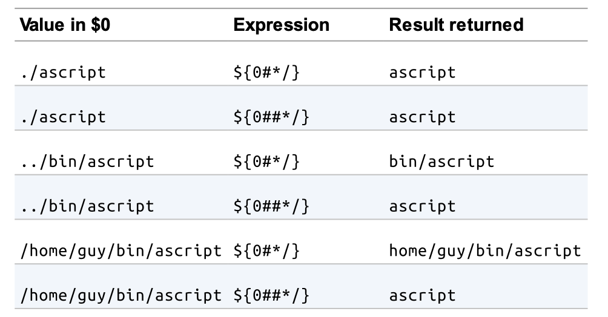
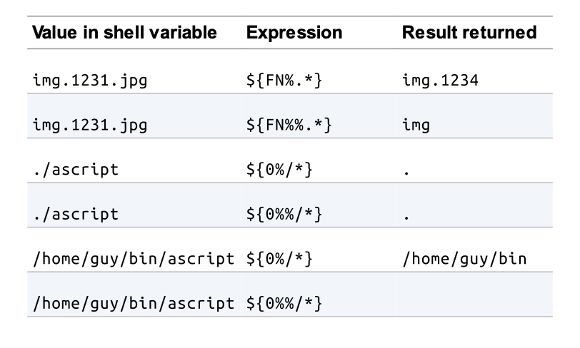
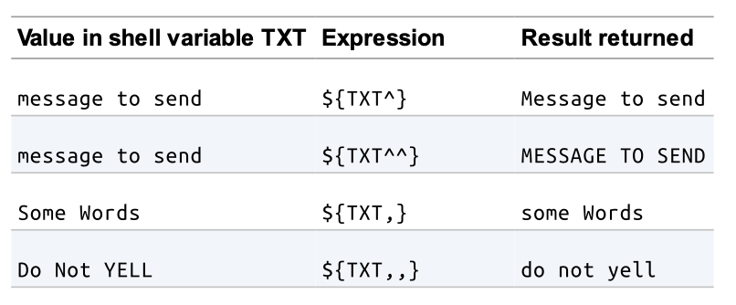
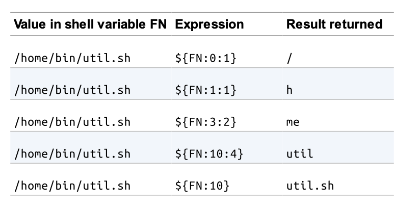
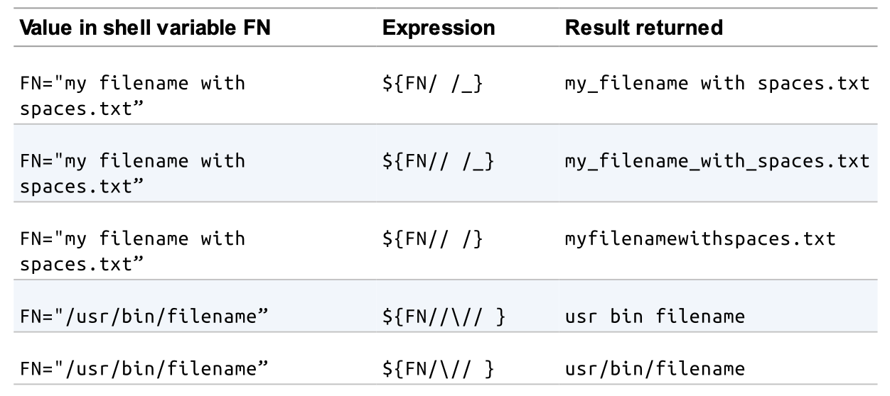
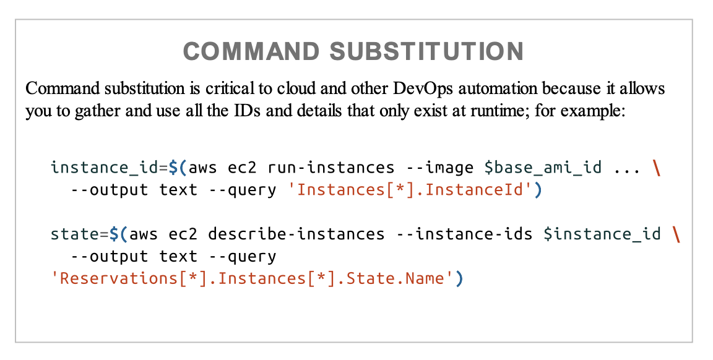

# Chapter 4

## Variable Reference

```bash
MSG="Error: FILE not found"


MSG="Error: $FILE not found"
```

Be sure to use double quotes if you want this string substitutions to occur. Using single quotes takes all characters literally, and no substitutions happen.

### Getting Length of variable value

This syntax, with the braces, is the foundation for much special syntax aroud variable references. For example, we can put a hash sign in front of a variable name `${#VAR}`, to return not its value but the string length of the value.

```bash
VAR="oneword"

echo ${#VAR} # Display 7
```

You can use the `$0`, to get the basename of your script.

### Path or Prefix Removal

You can remove characters from the front (prefix or left hand side) or the tail(suffix or right hand side) of that value. To remove a certain set of characters from the left side of a string, you add a # a shell pattern onto the parameter reference, a patter that matches those characters that you want to remove.

The expression `${MYVAl#img_}` would remove the characters.



### Shorthand for dirname or Suffix Removal

Similar to how `#` will remove a prefix, that is, remove from the lefthand side, we can remove a suffix, that is, from the righthand side, by using `%`.

A double percent sign indicates removing the longest possible match.

Here are some examples that show how to remove a suffix.



### Other Modifiers

You can convert either the first character or all characters in a string to uppercase via `^` or `^^`, respectively, or to lowercase via `,` or `,,` as shown in these examples:



### Substring the characters

Use the colon and the length of the substring you want.



### Anywhere substitution

The most flexible modifier is the one that does a substitution anywhere in the string, not just at the front or tail of the string. Similar to the `sed` command, it uses the slash `/`, to indicate what pattern to match and what value to replace it with. A single slash means a single substitution.

> [!IMPORTANT]
> Using two slashes means to replace every occurrence.



## Conditional Substitutions

Some of these variable substitutions are conditional. They happen only if certain conditions are met.

You could accomplish the same thing using `if` statements around the assignments, but these idioms make for shorter code for certain common cases.

Common scenario is, if the parameter isn't supplied then a default value would the dash and the righthand side.

```bash
LEN=${1:-5}
```

### Comma-Separated Lists

Another conditional substitution, using the plus sign, also checks to see if the variable has a value and if so, if it will return a different value.

### Modified Value

If `VAR` is empty or unset, it will assign that value to the variable and return that value. If `VAR` is already set, it will simply return its existing value.

> [!CAUTION]
> Note, however, that this assigning of a value does not work for positional parameters (like $1), which is why you don't see it used nearly as often.

```bash
${VAR:=value}
```

### $RANDOM

Bash has a very handy `$RANDOM` variable.

```bash
echo $RANDOM # This will generate a random number between 0 - 32767
```

## Command Substitution

> [!TIP]
> Command substitution in Bash allows you to capture the output of a command and use it as a variable or part of a larger command. It is a powerful feature that helps in dynamically assigning values based on the result of command execution.

Its just basically execute the command inside the `$()` and assign the output of that command to a variable.

This is a command substitution using a `POSIX` syntax `$()`. The old Bourne way to do it is *``* (backticks/backquotes).

But the preferred way is the POSIX `$()`



## Style and Readability: Recap

When referencing a variable in bash, you have the opportunity to edit the value as you set or retrieve it. A few special characters at the end of the variable reference can remove characters from the front or end of the string value, alter its characters to upper- or lowercase, substitute characters, or give you just a substring of the original value. Common use of these handy features results in idioms for default values, and substitutes, and the creation of a comma-separated list without using an explicit statement.

> [!IMPORTANT]
> Command Substitution
> Command Substitution is critical to cloud and other DevOps automation because it allows you to gather and use all the IDs and details that only exist at runtime; for example

```bash
instance_id=$(aws ec2 run-instances --image $base_ami_id ... \
  --output text --query 'Instances[*].InstanceId')

stage=$(aws ec2 describe-instances --instance-ids $instance_id \
  --output text --query 'Reservations[*].Instances[*].State.Name')
```

> [!NOTE]
> Variable substitutions are a great feature in bash, and we recommend making good use of them. However, we also strongly recommend that you comment those statements to make it clear what sort of substitution you are attempting. The next reader of your code will thank you.
